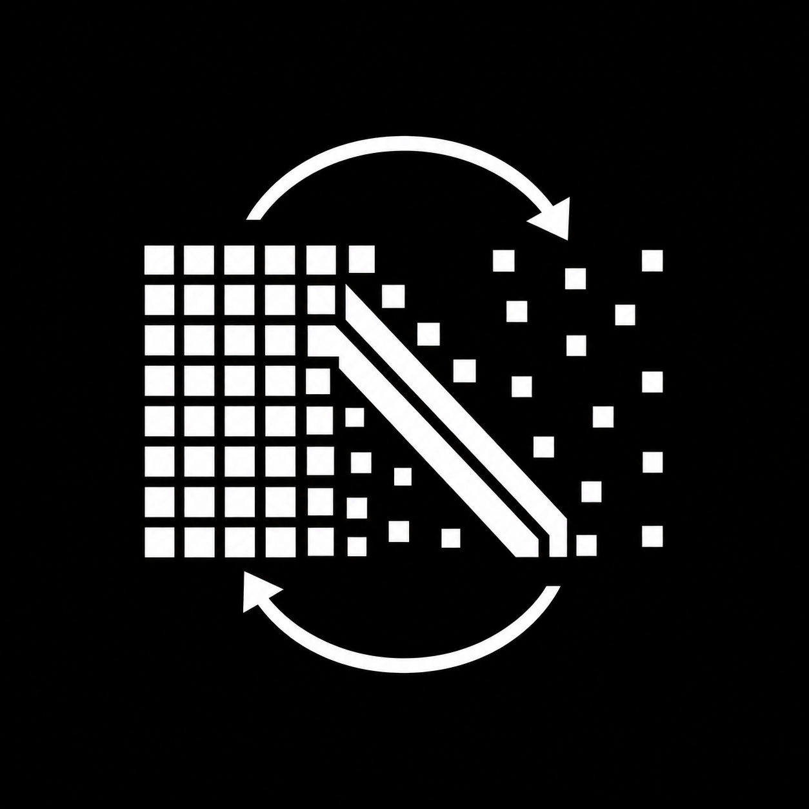

<p align="center">
  
</p>

<h1 align="center">SALAAD</h1>

<p align="center">
  <strong>Sparse And Low-Rank Adaptation via ADMM for Large Language Model Inference</strong>
</p>

<p align="center">
  Official implementation of SALAAD, a plug-and-play framework for inducing
  sparse plus low-rank structure during language-model pretraining.
</p>

SALAAD operates in weight space and does not require architectural changes to
the underlying Transformer model. During training, selected weight matrices are
coupled to structured surrogate variables through an ADMM-style objective:

$$
X \approx L + S
$$

Here $X$ is the trainable weight, $L$ is a low-rank component, and $S$ is a
sparse component. A single SALAAD-trained checkpoint can be adapted to a
continuous range of parameter budgets by adjusting the effective rank and
sparsity of the learned surrogate weights.

The code currently focuses on LLaMA-style causal language models and includes
training, evaluation, Hugging Face export, and LM Evaluation Harness workflows.

## Method Overview

Let a language model contain selected weight blocks `{X_i}_{i=1}^N`, where each
block is a linear map in the Transformer, such as attention projections, MLP
projections, or embeddings. SALAAD introduces a sparse plus low-rank surrogate
for each selected block:

$$
X_i = L_i + S_i
$$

where `L_i` captures the dominant low-rank structure and `S_i` captures sparse
residual variation. For one block, the problem is formulated as:

$$
\begin{aligned}
\min_{X,L,S}\quad & \ell(X) + \alpha \lVert L \rVert_* + \beta \lVert S \rVert_1 \\
\text{s.t.}\quad & X = L + S
\end{aligned}
$$

Here $\ell(X)$ is the task loss, $\lVert L \rVert_*$ is the nuclear norm
surrogate for rank, and $\lVert S \rVert_1$ is the elementwise L1 surrogate for
sparsity. SALAAD solves this constrained objective with an ADMM-style procedure.
The dense weight `X` is updated by standard backpropagation on the coupled loss:

$$
\ell_c(X) =
\ell(X) + \frac{\rho}{2}
\left\lVert X - L - S + \frac{Y}{\rho} \right\rVert_F^2
$$

Then the structured variables are recovered with closed-form proximal updates:

$$
\begin{aligned}
L &\leftarrow \operatorname{SVT}_{\alpha / \rho}\left(X - S + Y / \rho\right) \\
S &\leftarrow \operatorname{soft}_{\beta / \rho}\left(X - L + Y / \rho\right) \\
Y &\leftarrow Y + \rho (X - L - S)
\end{aligned}
$$

This produces both the trained dense weights $X$ and the structured surrogate
$\hat{X} = L + S$. The dense model is not forced to be exactly sparse or low-rank;
instead, the ADMM penalty keeps it close to a structured surrogate throughout
training.

SALAAD also uses an I-controller to adapt the block-wise thresholding levels
`alpha` and `beta` from the observed effective rank of `L` and density of `S`.
This lets different Transformer blocks acquire different ranks and sparsity
patterns without manually assigning per-layer schedules.

At deployment time, the learned surrogate can be further compressed with
Homomorphic Parameter Allocation (HPA): singular values and sparse entries are
truncated according to a target parameter budget. As a result, one SALAAD
checkpoint can produce a continuous family of architecture-preserving surrogate
models without retraining.

## Repository Layout

| Path | Purpose |
| --- | --- |
| `salaad/` | Core trainer, ADMM solver, operators, and utilities |
| `models/` | Local LLaMA model implementation |
| `dataloaders/` | Iterable C4/tokenization utilities |
| `configs/` | Small example training and model configs |
| `scripts/` | Training, evaluation, resave, and lm-eval entry points |
| `tests/` | Lightweight smoke tests |

The main training path is:

```text
scripts/train_salad.py
  -> salaad/register.py
  -> salaad/trainer_salad.py
  -> salaad/salad_solver.py
```

## Installation

Use Python 3.9+ and install a PyTorch build that matches your CUDA environment
before installing this package. See the PyTorch installation instructions for
the correct command for your system.

```bash
python -m venv .venv
source .venv/bin/activate
pip install --upgrade pip
# Install PyTorch separately for your CUDA/CPU environment first.
pip install -e ".[dev]"
```

Training streams C4 from Hugging Face. If you need gated resources or hit rate
limits, authenticate before running:

```bash
huggingface-cli login
```

Weights & Biases logging is optional. If enabled in a config, set:

```bash
export WANDB_API_KEY=...
export WANDB_ENTITY=...
```

## Quickstart

Run the lightweight solver smoke test first:

```bash
python -m pytest tests/test_smoke.py -q
```

For real training, start with the debug configuration. This command streams C4
from Hugging Face and expects a working PyTorch distributed/CUDA setup:

```bash
torchrun \
  --nproc_per_node=1 \
  --nnodes=1 \
  --rdzv_backend=c10d \
  --rdzv_endpoint=127.0.0.1:29500 \
  scripts/train_salad.py \
  --cfg_version llama_debug \
  --folder debug
```

Outputs are written to:

```text
data/<folder>/<cfg_version>/<timestamp>/
```

Typical outputs include `model.pth`, copied config files, `layer_info.pkl`, and
rank-local `matrix_rank<N>.pkl` files containing the low-rank, sparse, and dual
variables.

## Configuration

Training configs live in `configs/*.yaml`; matching architecture configs live in
`configs/*_model.json`.

Important fields:

- `training_mode`: `salad` for low-rank/sparse training or `vanilla` for normal training.
- `num_total_iters`: total optimizer updates.
- `num_freq`: how often to run ADMM updates.
- `layers`: model layers to decompose.
- `rate_rank`: target low-rank ratio for a layer.
- `rate_sparsity`: target sparse density for a layer.
- `rho_dict`, `alpha_dict`, `beta_dict`: ADMM penalty and adaptive threshold settings.

## Evaluation Workflow

Evaluate a trained SALAAD run directly from its output directory:

```bash
python scripts/evaluation.py \
  --run_dir data/debug/llama_debug/<timestamp> \
  --target_params 6.5
```

Resave the checkpoint in Hugging Face format:

```bash
python scripts/resave_model.py \
  --run_dir data/debug/llama_debug/<timestamp> \
  --target_params 6.5 \
  --gamma 0.5
```

This writes:

```text
data/debug/llama_debug/<timestamp>/model_resave/vanilla/
data/debug/llama_debug/<timestamp>/model_resave/surrogate/
```

Run LM Evaluation Harness on a resaved model:

```bash
python scripts/run_lm_eval.py \
  --model_dir data/debug/llama_debug/<timestamp>/model_resave \
  --variant both \
  --tasks piqa boolq \
  --batch_size 8
```

Use `--variant direct` if `--model_dir` points directly to a Hugging Face model
folder rather than a directory containing `vanilla/` and `surrogate/`.

## Notes

This is research code. Start with `llama_debug`, verify dataset streaming in
your environment, and avoid committing generated checkpoints or experiment
outputs.

## License

This repository is released under the Creative Commons
Attribution-NonCommercial 4.0 International License (CC BY-NC 4.0). The code is
available for non-commercial research use. Commercial use is not permitted
without prior written permission from the copyright holders.

Some files include code adapted from third-party projects under their original
licenses. See `NOTICE` for attribution details.

## Citation

If you use this codebase, please cite:

```bibtex
@inproceedings{ma2026salaad,
  title     = {{SALAAD}: {Sparse And Low-Rank Adaptation via {ADMM} for Large Language Model Inference}},
  author    = {Ma, Hao and Bal, Melis Ilayda and Zhang, Liang and Li, Bingcong and He, Niao and Zeilinger, Melanie and Muehlebach, Michael},
  booktitle = {Proceedings of the International Conference on Machine Learning},
  volume    = {306},
  year      = {2026},
  address   = {Seoul, South Korea},
  publisher = {PMLR}
}
```
